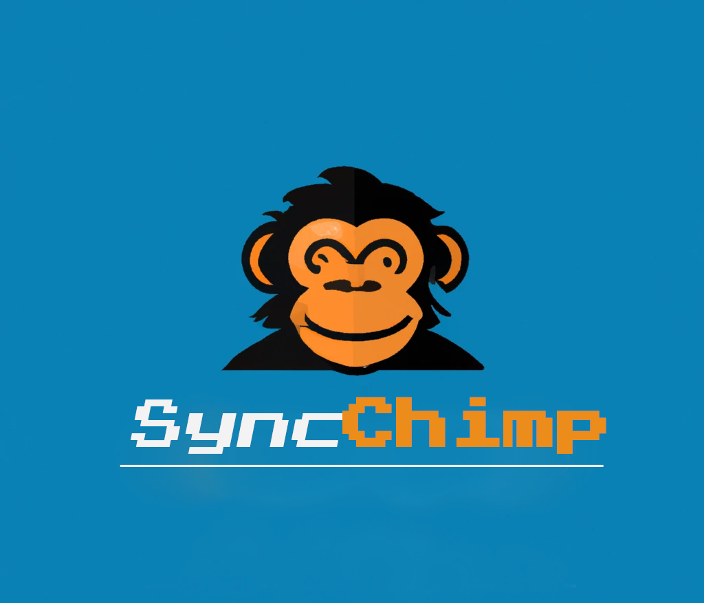

# SyncChimp v1.0.0

<p align="center">
  
  
  
</p>
<p align="center"><i>This image was generated with Dall-e 2 AI</i></p>

<br><br><br>

SyncChimp syncs contacts from MockAPI to Mailchimp. It retrieves contact data from MockAPI and creates new members in a new Mailchimp list. Keep your email lists updated in real-time with SyncChimp.


# Architecture 

This architecture provides a separation of concerns, making the application more modular and maintainable. In this project, this architecture is being used to create a backend system that processes requests from a user and interacts with the database to return a response.

* The presentation layer (api/):
Is responsible for receiving and processing user requests, passing them to the application layer, and returning responses back to the user. It's the interface between the user and the system.

* The application layer (services/):
Contains the application logic that processes user requests. It communicates with the data layer to perform CRUD operations on the database. It's responsible for implementing business rules and orchestrating the data retrieval and data processing.


# Structure explanation:

###  api/: 
Contains the files necessary to implement the presentation layer of the architecture. 
Includes drivers, routes, and services for contact synchronization functionality.

### docker/: 
Contains the files needed to deploy the application in containers. It includes Dockerfiles for each container needed and a docker-compose.yml file to orchestrate the containers.

### tests/: 
Contains the files needed for automated testing of the application. It includes tests of the presentation layer and the data storage layer.

### .gitignore: 
File that specifies the files and directories to be ignored by Git.

### README.md: 
File containing the project documentation.

### package.json: 
NPM configuration file that specifies the dependencies and scripts of the project.

### tsconfig.json: 
A TypeScript configuration file that specifies how to compile TypeScript code into JavaScript.

### Dockerfile: 
File that specifies how to build the Docker image for the application.


## Requirements

* [NodeJS](https://nodejs.org/en/download "NodeJS")
* [Docker](https://docs.docker.com/engine/install/ubuntu/)
* [Javascript](https://www.npmjs.com/package/javascript)

# Dependencies description in this project

* Jest: A testing library for JavaScript code. It will be used to write unit and integration tests to ensure the quality and correctness of the code in this project.

* Morgan: 
A middleware that logs HTTP requests and responses for Node.js. It will be used to log incoming requests and responses in the server's console for debugging and monitoring purposes.

* Nodemon: 
A tool that watches for file changes and automatically restarts the Node.js server. It will be used to speed up development by automatically restarting the server when code changes are made.

* Standard: 
A JavaScript linter that helps to enforce consistent style and good practices in the code. It will be used to ensure that the code in this project adheres to the Standard style and best practices.

* Supertest: 
A library that provides a high-level abstraction for testing HTTP requests. It will be used in combination with Jest to write integration tests for the API endpoints in this project.


* Winston: 
A versatile logging library for Node.js. It will be used to log server events and errors to different transports (such as console, file, or third-party services) for debugging and monitoring purposes.

* Cors: 
A middleware that enables Cross-Origin Resource Sharing (CORS) in the server. It will be used to allow requests from different domains or origins to access the API endpoints in this project.

* Express: 
A minimalist web framework for Node.js. It will be used to create the API endpoints, handle incoming requests, and send responses.

* Helmet: 
A middleware that provides security features for Express. It will be used to add headers and prevent common web vulnerabilities, such as XSS and CSRF.

## To run development mode

You have to use the following command to start a development server:

```sh
npm run dev
```

See `package.json` for more details.

Use following command to start project on staging and production environments:

```sh
npm start
```

Trigger the endpoint GET contacts/sync on local:

```sh
http://localhost:3000/api/v1/contacts/sync
```

*This will create a Synchronization with the backend and will fetch the mock api contact list and will format to a JSON structure*

See `package.json` for more details.

## Tests

Following tests libraries are used for unit/integration tests:
* [Jest](https://www.npmjs.com/package/jest)
* [Supertest](https://www.npmjs.com/package/supertest)


Tests are kept next to source with following pattern *.spec.js

Use following command to run tests:

```sh
npm test
```


## Docker container

There is available Docker container and Docker Composer if you would like to run the Node.js app


Then use following command to build Docker containers:

```sh
docker-compose up -d --build
```

See `Dockerfile` and `docker-compose.yml` for more details.


# Structure tree:


├── src

│   ├── api

│   │   ├── controllers/

│   │   │   └── syncController.js

│   │   ├── routes/

│   │   │   ├── api/

│   │   │   │   ├── v1/

│   │   │   │   │   └── routes.js

│   │   ├── services/

│   │   │   ├── listRecreationService.js

│   │   │   ├── mailchimpSyncContactsService.js

│   │   │   └── mockApiSyncService.js

│   ├── tests/

│   │   ├── api/

│   │   │   └── sync.test.js

├── .env

├── .dockerignore


├── .gitignore

├── Dockerfile

├── index.js

├── jest.config.js

├── LICENSE

├── mailchimp.config.js

├── package.json

├── README.md

└── tsconfig.json

